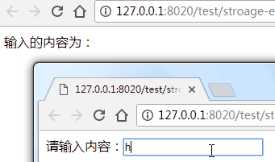

# 使用Storage Event进行页面通信

经常会遇到这样的场景，A页面打开B页面，B页面进行操作之后，更新A页面中相关的数据。

在以前，我们可能会使用postMessage或者直接操作父类的window进行实现，但这两种方式耦合度比较高，对页面维护并不友好。

我们可以使用HTML5的Storage Event来实现这个功能。

Storage Event本质上就是通过轮询LocalStoraged的value值变化来实现的事件监听。

下面，我们来实现这样一个小功能，A和B两个页面，B页面有个输入框，然后A页面实时显示B页面输入框中的数据。

效果如下：



A页面代码如下：

```HTML
输入的内容为：<label for=""></label>
<script type="text/javascript">
  $(window).bind('storage', function (e) {
    if(e.originalEvent.key == 'my_text') {
      var text = e.originalEvent.newValue;
      $('label').text(text);
    }
  });
</script>
```

页面中监听了**storage**这个事件，在当前域名下，如果有LocalStorage的值被修改，这个事件就会被触发。而这里的**my_text**也就是我们感兴趣的topic。当有storage事件被触发时，如果这个LocalStorage的key恰好为my_text我们就获取修改后的值，将它显示到页面上。

B页面代码如下：

```HTML
<label for="">请输入内容：<input type="text" onkeyup="onKeyUp()"/></label>
<script type="text/javascript">
  function onKeyUp() {
    var text = $('input').val();

    localStorage.setItem('my_text', text);
  }
</script>
```

B页面主要是监听输入框内容的变化，然后将输入框的内容保存到key为my_text的LocalStorage中。设置my_text时，当原值和新值不一致时，A页面中的storage事件就会被触发，从而达到了传递消息的效果。

**需要注意**，当调用`localStorage.setItem()`时，如果新值和原值一致，则storage事件不会被触发。此外，LocalStorage只支持字符串，使用时需要根据页面逻辑进行类型转换。